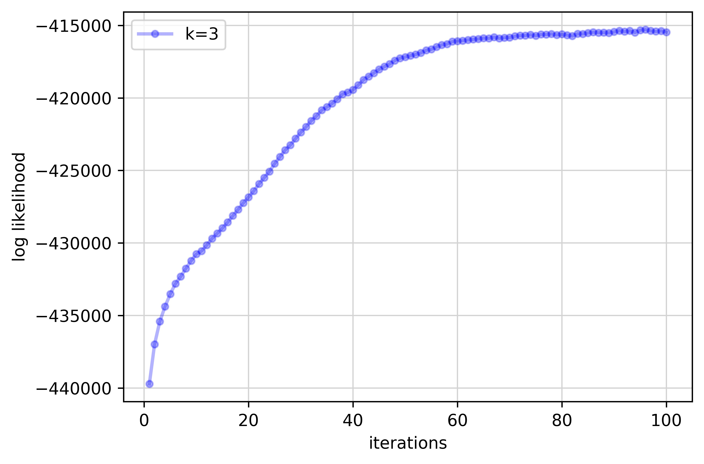
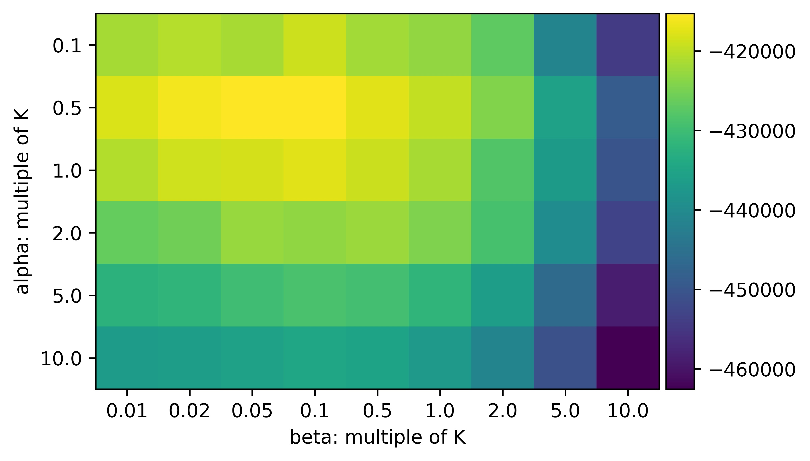
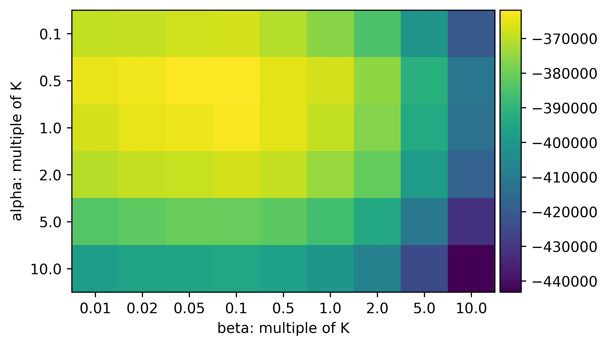
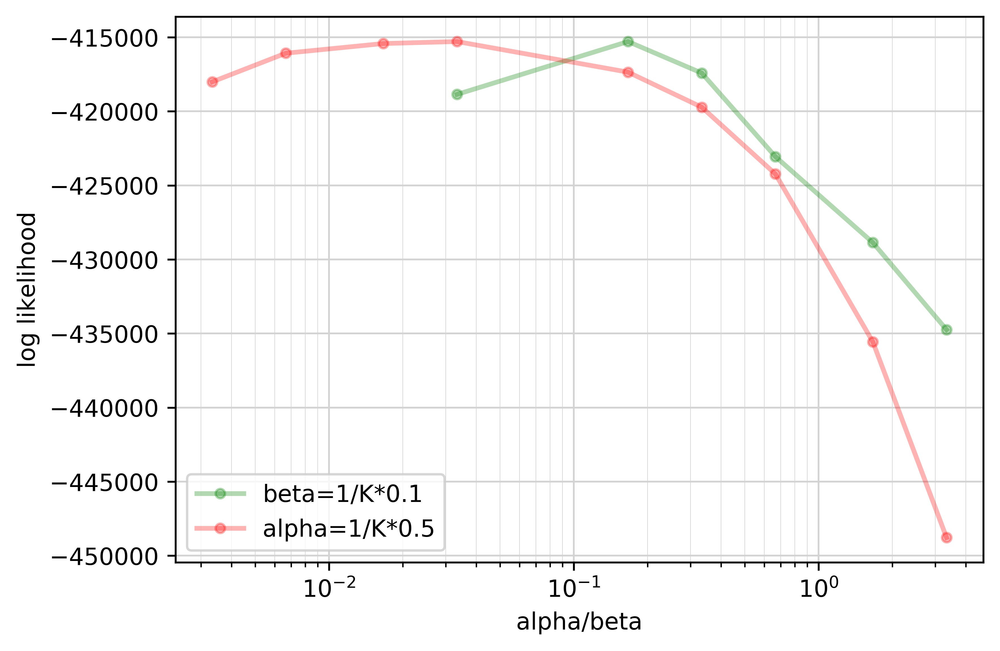
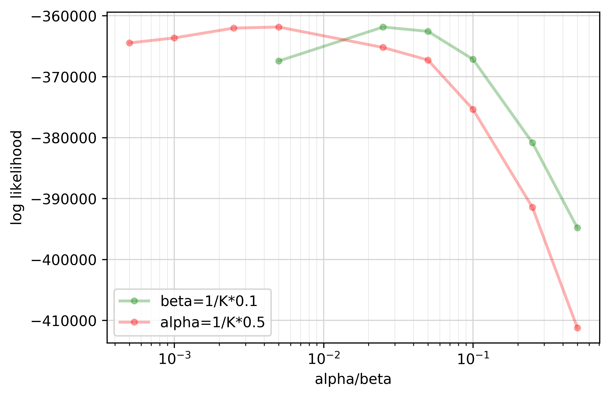
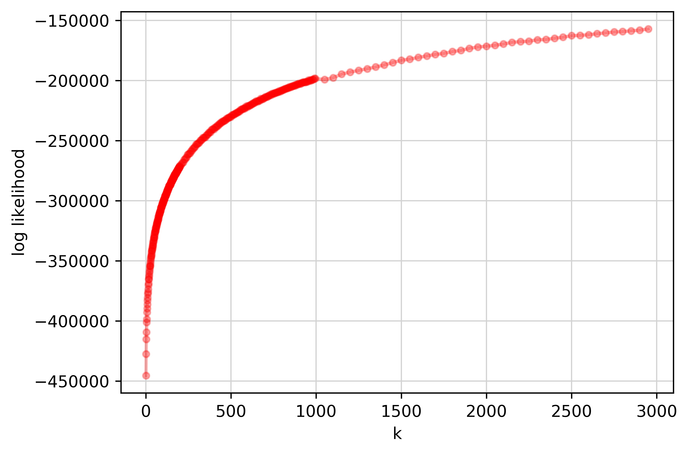
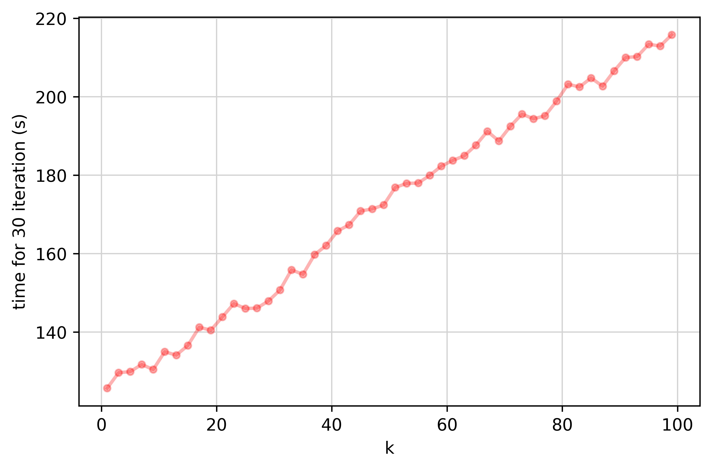

# Latent Dirichlet Allocation (LDA) with Gibbs Sampling

This repository implements latent Dirichlet allocation (LDA) using Gibbs sampling.

`gblda/` contains implementation of the Gibbs sampling LDA algorithm. `data/` contains training data. `plots/` contains sample plots. There are several useful scripts in the root directory of the repository, which we will describe in following sections.

## Prerequisites

- python3
- numpy
- matplotlib

## Run the code

The simplest way to run LDA is running the script

```shell
$ python run_lda.py
```

under the root directory of the repository. It will run LDA on training data for 100 iterations, and print top 10 representative words in each topic with respect to conditional probabilities, as well as the log likelihood on the corpus. It also plots a learning curve of this LDA.

| topic 0        | probability | topic 1     | probability | topic 2     | probability |
| -------------- | ----------- | ----------- | ----------- | ----------- | ----------- |
| learning       | 0.039981    | web         | 0.045289    | planning    | 0.024076    |
| data           | 0.015666    | semantic    | 0.024411    | systems     | 0.017970    |
| classification | 0.015666    | information | 0.024206    | learning    | 0.016928    |
| selection      | 0.010849    | knowledge   | 0.016121    | agents      | 0.015339    |
| support        | 0.010709    | data        | 0.014074    | agent       | 0.014148    |
| models         | 0.010242    | system      | 0.010901    | logic       | 0.013006    |
| vector         | 0.009774    | ontology    | 0.010287    | multi-agent | 0.011269    |
| clustering     | 0.008698    | extraction  | 0.008547    | reasoning   | 0.010524    |
| feature        | 0.008558    | user        | 0.008138    | programming | 0.009234    |
| networks       | 0.008511    | ontologies  | 0.007984    | model       | 0.008688    |

```
log likelihood: -415291.9636819961
```

From the above results, we can estimate each topic to be:

- topic 0: machine learning 
  - (it contains support vector, clustering, clssification, feature, etc.)
- topic 1: data mining, knowledge graph 
  - (it contains knowledge, extraction, web, system, etc.)
- topic 2: multi agent systems, reasoning and planning
  - (it contains agents, multi-agent, programming, logic, planning, etc.)



## Grid Search of Hyperparameters

In `gird_search_ab.py`, we search different hyperparameters for $\alpha$ and $\beta$.

For number of topics $K$ in $[2, 3, 5, 7, 10, 20]$, we pick

- $\alpha$ in $[0.1, 0.5, 1.0, 2.0, 5.0, 10.0]\times\dfrac{1}{K}$;
- $\beta$ in $[0.01, 0.02, 0.05, 0.1, 0.5, 1.0, 2.0, 5.0, 10.0]\times\dfrac{1}{K}$.

Supprisingly, it turns out that $\alpha=0.5/K$, and $\beta=0.1/K$ are best hyperparameters consistently for all  $K$ in $[2, 3, 5, 7, 10, 20]$. We plot grid search results for $K=3$ and $K=20$. Similar results can be plotted using `analyze_ab.py`.

| $K=3$                                                        | $K=20$                                                       |
| ------------------------------------------------------------ | ------------------------------------------------------------ |
|  |  |
|  |  |

## Different Number of Topics (K)

In `gird_searck_k.py`, we search different $K$ while keeping $\alpha=0.5/K$, $\beta=0.1/K$ fixed, which turns out to be the "best" choice according to our experiments in the previous section.

| log likelihood                                               | time                                                         |
| ------------------------------------------------------------ | ------------------------------------------------------------ |
|  |  |

In the experiment result, the log likelihood is monotonically increasing when $K$ increases. Time consumed per iteration is linear with respect to $K$.

When $K$ is large, each topic tends to become much more "fine-grained". The number of representative words decreases, and the conditional probabilities of those representative words increase. In the table below, we demonstrate the top 5 representative words in a topic when $K$ varies.

| K=3      | probability | K=20        | probability | K=40        | probability |
| -------- | ----------- | ----------- | ----------- | ----------- | ----------- |
| planning | 0.024076    | information | 0.045659    | random      | 0.046992    |
| systems  | 0.017970    | retrieval   | 0.032561    | conditional | 0.040584    |
| learning | 0.016928    | web         | 0.031438    | fields      | 0.034176    |
| agents   | 0.015339    | extraction  | 0.024701    | information | 0.022785    |
| agent    | 0.014148    | modeling    | 0.020210    | recognition | 0.019937    |

| K=200      | probability | K=700      | probability | K=3400      | probability  |
| ---------- | ----------- | ---------- | ----------- | ----------- | ------------ |
| support    | 0.232170    | e-commerce | 0.226680    | incremental | 0.927993     |
| vector     | 0.208479    | customer   | 0.120897    | unimem      | 0.058001     |
| machines   | 0.139776    | adaptive   | 0.105785    | underlying  | 1.705867e-06 |
| regression | 0.056858    | service    | 0.075561    | analyze     | 1.705867e-06 |
| sparse     | 0.037906    | evaluate   | 0.060449    | kbs         | 1.705867e-06 |

Observe that in our example of $K=3400$, the topic almost only consists of the word "incremental" (its conditional probability if 0.927993). It is meaningless. Therefore, in practice, we should choose $K$ with respect to our demands, number of documents, and size of vocabulary.

## Explanation of Primary Codes

Before train LDA on data, first create a LDA instance.

```python
lda = LDA.GibbsLDA(n_components=3, doc_topic_prior=0.5/3, topic_word_prior=0.1/3,
                   iterations=100)
```

`n_components` is the number of topics. `doc_topic_prior` is $\alpha$, `topic_word_prior` is $\beta$. `iterations` is the number of iterations to run Gibbs sampling.

Then, it is able to fit LDA on data.

```python
# X is a list of strings, where each string represents a document.
# The documents will be parsed with space to get all words.
lda.fit(X)  
```

In `fit`, the specified iterations will be conducted. `_gibbs_sampling_iteration` implements the Gibbs sampling logic, `_conditional_z` implements the sampling of $z$ according to conditional probability.